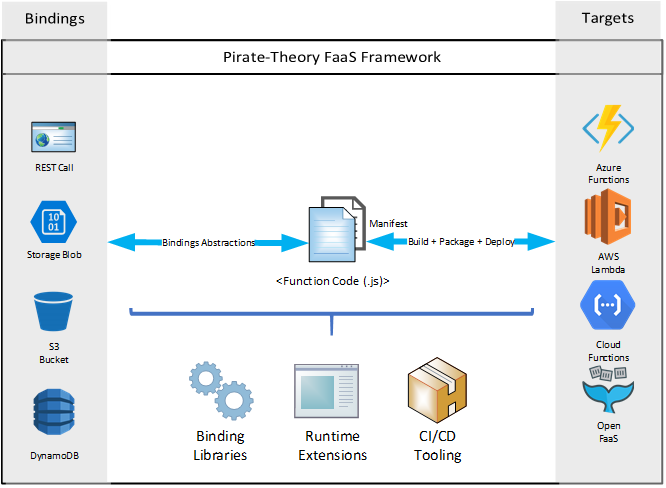

# PIRATE-THEORY

Pirate-Theory is a cloud agnostic serverless FaaS enabler.

## WHAT IT IS

Build your code without bothering with function plumbing. Use a wide range of triggers, inputs and outputs. Deploy one function code to different FaaS solution providers.

## FAQs

1. What is FaaS?

    FaaS stands for Function as a Service, a way to develop event driven micro services by focusing on the objectives called functions, not the plumbing.

    Pirate-Theory handles the function's plumbing providing a clean and predictive structure.

1. What is serverless computing?

    Serverless computing still requires servers. However, serverless computing means you don't have to handle the underlying complexity of the infrastructure while also providing near limitless computing power.

    Pirate-Theory let's you deploy your functions onto different FaaS environments such as:

    - Azure Functions
    - AWS Lambda
    - Cloud Functions
    - Open FaaS

1. What are event driven micro services

    Event driven micro services are triggered by events generated in the cloud infrastructure. These events can be raised from storage changes, new queue messages, stream processing or commonly HTTP calls.

    Pirate-Theory provides a unified entry point to your functions code decoupling cloud specific bindings and your code through abstraction.

1. How does Pirate-Theory help?

    Pirate-Theory enables multi cloud deployment scenario, bindings expansion and unified interfaces so the functions you build can be deployed anywhere with only minor changes to the configuration.

1. What programming runtimes Pirate-Theory supports?

    For this POC the target is NodeJS through TypeScript. However, C# on DotNetCore is the next target.

## DESIGN

The tool comes as a set of loosely coupled libraries, executables and scripts which helps you abstract your functions from the bindings and execution platforms.

